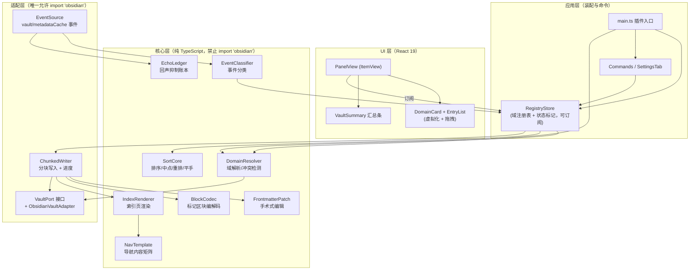
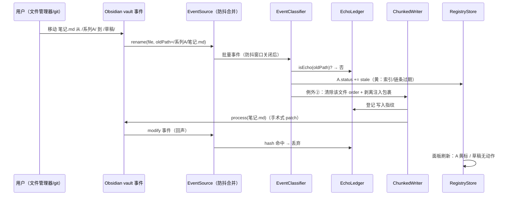
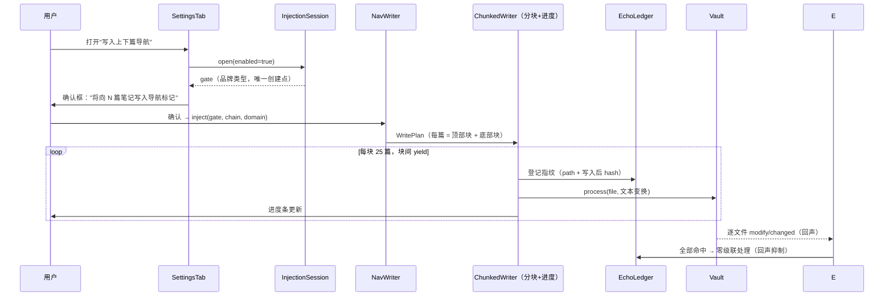

# 方案设计文档：Chapter Trail（Obsidian 插件）

## 文档信息

| 项目 | 内容 |
|------|------|
| 文档 | Chapter Trail 方案设计文档（技术选型 + 架构 + 开发流程） |
| 版本 | v1.1 |
| 日期 | 2026-10-06（v1.0 初版 2026-10-05） |
| 修订记录 | v1.1 采纳用户评审 4 项：① 索引页用户产权保护（§4.6）；② 过密插入 normalize 时序与 Diff 最小化（§4.3/§5.1）；③ FrontmatterPatch 注释/锚点鲁棒性（§4.4/§5.2）；④ Quartz slug 与总览链接规范（§5.6/T0-1/C3） |
| 需求基线 | PRD v1.3（2026-10-04 已确认基线，见 [docs/PRD.md](./PRD.md)） |
| 技术调研截止 | **2026-10-05**（所有生态现状、版本号均以此日期检索核实，来源见附录 B） |
| 已拍板决定 | 面板 UI = React 19 方案；本文档 = 单文件 Markdown；深度 = 含接口草图与算法伪代码（2026-10-05 确认） |
| 标注约定 | 沿用 PRD：【已确认】用户拍板 /【设计决策】本文档裁量，可复议 /【T0 待定】进入开发前必须实测定案 |

**快速导读**：§1 目标与原则 → §2 总体架构（分层、接缝、数据模型）→ §3 技术选型对比（重点章节，10 组对比）→ §4 模块设计与关键时序 → §5 核心算法细节（order/手术式 frontmatter/回声抑制等）→ §6 测试方案（A1–A11 映射）→ §7 开发流程（T0 清单、里程碑、CI、发布）→ §8 风险登记 → §9 需求追踪矩阵。

---

## 1. 背景与目标

### 1.1 项目定位

Chapter Trail 是一款 Obsidian 社区插件（MIT、免费、纯本地、无遥测），为"按文件夹组织成体系内容并发布到 Quartz"的作者提供三件一体能力：

1. **文件夹级自定义排序**：order 数值字段存于笔记 frontmatter，随文件走；
2. **自动维护的文件夹索引页（MOC）**：真实 Markdown 内容，重建手动触发；
3. **静态可发布的系列导航**：上一篇/下一篇/返回总览，以包裹标记 + 可折叠 callout 写入正文，Quartz 原样发布即可点击。

完整需求、规则与验收标准以 PRD v1.3 为准，本文档不重复需求细节，只回答"**怎么实现、用什么实现、按什么流程实现、为什么这样选**"。

### 1.2 设计目标（可验证）

| # | 目标 | 度量 |
|---|------|------|
| G1 | 功能符合 PRD §2 全部规则与 §7 验收标准 A1–A11 | 测试方案 §6 全绿 |
| G2 | 性能：1 万篇笔记启动扫描 < 2s；500 文件域拖拽 < 100ms、全量重排 < 5s | A9 基准测试 |
| G3 | 可逆性契约：全部清除后，除明确枚举的范围外文件零改动 | A8 枚举断言 |
| G4 | 硬性不变量：注入开关关闭期间零注入内容写入 | A3 回归测试（§5.5 的闸门设计） |
| G5 | 零后端、零遥测、状态即文件（无插件私有数据库） | 架构约束，代码评审项 |
| G6 | 按社区插件可发布标准打造（人工审核通过为最终门槛） | §7.5 提交清单 |

### 1.3 非目标（v1）

与 PRD §3 一致：不做阅读视图动态渲染、不做 UI 多语言（v1 仅英文 UI）、不承诺移动端、不做嵌套 series 融合语义（只做冲突检测与处置）、不做 Notebook Navigator 导入、不做 Bases/属性视图集成与 Quartz 专用输出格式、不支持 vault 根目录作为受管域。

### 1.4 全局设计原则

以下六条原则贯穿所有后续设计，出现权衡冲突时按此裁决：

1. **状态即文件**：排序、模式、排除等全部状态存在于笔记与索引页 frontmatter 中，插件不维护私有数据库。移动文件 = 状态自动迁移。这是"git 友好、跨 vault 可移植、退出可逆"的根基【已确认（PRD）】。
2. **显式且可逆**：批量重建类操作一律手动触发；仅两项单文件自动化例外（入域写 order、出域清 order 与注入）。所有批量写入前有确认框，全部有退出路径【已确认（PRD）】。
3. **产权划分**：插件只碰自己的键（`is-index`、`mode`、`order`、`excluded`、`excluded-folders`）与两类包裹标记区块；用户的其他 frontmatter 键与区块外内容**逐字节不触碰**【已确认（PRD）】。这条直接决定了 §5.2 的"手术式 frontmatter 编辑"方案。
4. **深模块、小接口**：核心逻辑全部收敛为少数几个"小接口、大实现"的纯 TS 模块（如 `SortCore`、`FrontmatterPatch`），复杂性隐藏在实现里；Obsidian API 被隔离在唯一适配层（§2.2），使核心可在 Node 环境下被 100% 单元测试。
5. **零依赖倾向**：能用 20 行自研代码 + 原生 API 解决的，不引入运行时依赖（日期解析、YAML 写入、拖拽之外的 UI 逻辑均零依赖）。每个被引入的依赖必须通过 §3 的对比论证，且记录"移除成本"。
6. **最小写入**：日常操作只写必须写的那几个文件（插入 = 单文件 order 落位；重排 = 整域规范化），Git diff 最小化【已确认（PRD）】。

---

## 2. 总体架构

### 2.1 架构总览



分层规则：

- **核心层（`src/core/`）**：纯 TypeScript，**编译期禁止 import `obsidian`**（用 ESLint/Biome 规则 + 目录约定双保险）。所有需求规则（§2.2–2.8）都在这一层实现为纯函数/纯类，输入输出均为普通数据结构。**这一层可以在 Node + Vitest 环境下 100% 单元测试，不需要启动 Obsidian。**
- **适配层（`src/adapter/`）**：仓库中唯一允许 `import 'obsidian'` 的层。定义 `VaultPort`、`ClockPort`、`NotifierPort`、`ConfirmPort` 四个端口接口并提供 Obsidian 适配器实现。核心层与 UI 层只依赖端口接口，不依赖 Obsidian 类型。
- **应用层**：`main.ts` 负责装配（把 Obsidian 适配器注入端口）、注册命令/视图/设置页、订阅事件；`RegistryStore` 是唯一的可变状态持有者（域注册表 + 三色状态标记），向 UI 提供订阅接口。
- **UI 层**：React 19 渲染管理面板（一个 `ItemView`）；设置页仍用 Obsidian 原生 `Setting` API（表单类 UI 用原生更贴合主题且代码量更小）。

### 2.2 关键接缝（Ports）

| 端口 | 接口（草图） | 职责 | 测试替身 |
|------|--------------|------|----------|
| `VaultPort` | `listMarkdownFiles()`, `read(path)`, `process(path, fn)`, `exists(path)`, `onRawEvent(h)` | 文件读写与原子写；原始事件流 | `FakeVault`：内存 Map + 事件重放（约 150 行） |
| `ClockPort` | `now()`, `setTimeout/clearTimeout` | 防抖窗口、账本 TTL | Vitest `vi.useFakeTimers()` |
| `NotifierPort` | `notice(msg, opts)`, `progress(ratio)` | 提示与进度条 | 测试中静默记录 |
| `ConfirmPort` | `confirm(spec): Promise<choice>` | 确认框/三选一弹窗（同名采纳、模式选择等） | 直接返回预设选择 |

> 设计意图（深模块原则）：`VaultPort.process(path, fn)` 一个方法隐藏了"读文件 → 变换 → 原子写回 → 通知写账本"的全部行为，调用方（重建索引、注入、重排）都只面对这一个小接口。Obsidian 的 `vault.process()` 是官方推荐的原子写 API（比 `modify` 少一次竞态窗口），适配器内直接桥接。

### 2.3 三条核心数据流

**① 启动扫描流**（一次性，对应 A9）：

```
metadataCache.on('resolved')
  → VaultPort.listMarkdownFiles()                    （O(n)，仅列路径）
  → 读 metadataCache 缓存的 frontmatter（零文件 IO）   （筛出 is-index 候选）
  → 对候选（通常个位数~几十个）读正文验证标记区块       （少量 IO）
  → DomainResolver.buildRegistry()                    （纯计算）
  → RegistryStore.publish()                           （面板渲染）
```

关键点：**启动时不读全库正文**。frontmatter 全部来自 `metadataCache`（Obsidian 已缓存），只有索引页候选需要读正文验证标记区块。1 万篇笔记下启动扫描是"1 次列表 + 几十次小文件读"，2 秒目标余量充足。

**② 事件增量流**（持续，对应 A5/A10）：

```
vault 事件 (create/delete/rename/modify) + metadataCache.on('changed')
  → EchoLedger.isEcho(path, contentHash)?  → 是：丢弃（回声抑制）
  → EventSource 防抖窗口（750ms）内按 path 合并
  → EventClassifier.classify(batch) → Action[]
       ├─ EnterManaged(单文件)      → 写 order = 尾值+10000     （自动化例外①）
       ├─ LeaveManaged              → 清 order + 剥注入 + 原域标黄（自动化例外②）
       ├─ EnterBatch(≥5)            → 目标域整批蓝标"待排序"
       ├─ RenameInDomain            → 重写索引页 frontmatter 路径引用（兜底）
       ├─ DeleteInChain             → 域红标"断链"
       └─ MetaChanged(索引页)       → 重读 mode/excluded-folders
  → RegistryStore 更新状态标记 → 面板刷新
```

**③ 手动重建流**（用户触发，对应 A1/A2/A3/A6）：

```
命令/面板按钮 → 确认框（显示将写入的文件数）
  → SortCore / IndexRenderer / NavInjector 计算变更计划
  → ChunkedWriter 分块执行（每块 25 篇，块间 yield，进度条）
  → 每次写入前登记 EchoLedger（内容指纹）
  → 完成后重扫受影响域 → RegistryStore 刷新
```

### 2.4 核心数据模型（TS 草图）

```typescript
// ---------- 标识与常量 ----------
type DomainId = string;              // 域根文件夹路径（vault 相对、POSIX 分隔、非根）
type VaultPath = string;             // 任意 vault 相对路径

const STEP = 10_000;                 // order 初始/重排步长【已确认：PRD v1.3】
const GAP_THRESHOLD = 10;            // 相邻间隙 < 10 → 建议重排【已确认】
const BATCH_THRESHOLD = 5;           // 防抖窗口内新增 ≥ 5 篇 → 整批蓝标【已确认】
const WRITE_CHUNK = 25;              // 批量写入分块大小【设计决策】
const DEBOUNCE_MS = 750;             // 事件合并窗口【设计决策】

// 插件产权键（唯一允许插件写入的 frontmatter 键）
const PLUGIN_KEYS = {
  isIndex: 'is-index',
  mode: 'mode',
  order: 'order',
  excluded: 'excluded',
  excludedFolders: 'excluded-folders',
} as const;

// ---------- 域与条目 ----------
interface ManagedDomain {
  root: DomainId;                          // v1 不变量：非 vault 根
  mode: 'independent' | 'series';
  indexPath: VaultPath;                    // 本域索引页（含 is-index + 标记区块）
  entries: OrderEntry[];                   // 排序后的链条条目（含计算好的混排序）
  excludedFolders: RelativePath[];         // 相对域根【已确认】
  status: DomainStatus;                    // 三色状态标记
}

type EntryKind = 'file' | 'managed-folder'; // independent 模式下条目分两类
interface OrderEntry {
  path: VaultPath;
  kind: EntryKind;
  order?: number;                          // managed-folder 条目取其索引页 frontmatter 的 order
  date?: { created?: string; updated?: string };  // 仅 file 条目，白名单解析结果
}

// ---------- 三色状态【已确认：红黄蓝语义，红色合并】 ----------
interface DomainStatus {
  broken: VaultPath[];        // 红：断链（条目指向不存在的文件）
  conflicts: string[];        // 红：结构冲突（series 域嵌套 is-index、双索引页）
  pending: VaultPath[];       // 蓝：待排序（入域未赋值）
  stale: boolean;             // 黄：索引/链条过期
  ties: VaultPath[];          // 黄：order 平手
  tightGap: boolean;          // 黄：相邻间隙 < 10，建议重排
  legacyOrders: VaultPath[];  // 黄：域解散后的遗留 order 提示（vault 级）
}

// ---------- 注册表（唯一可变状态） ----------
interface Registry {
  domains: Map<DomainId, ManagedDomain>;   // 受管域
  orphans: VaultPath[];                    // 带标记但结构异常的孤儿索引页
  legacyOrders: Map<DomainId, VaultPath[]>;// 已解散域的遗留 order
}
```

`RegistryStore` 将 `Registry` 包装为不可变快照 + 订阅通知（React 侧用 `useSyncExternalStore` 消费），任何变更都是"计算新快照 → 整体替换 → 通知"，杜绝 UI 与核心各自维护状态副本。

---

## 3. 技术选型（重点：对比与决策）

### 3.0 选型总则

1. **生态活跃度 > 功能数量**：本文所有"活跃"判定以检索日（2026-10-05）的发布记录、issue 响应为据；候选若处于维护停滞（哪怕功能完备）直接降级，如 dnd-kit（§3.5）。
2. **能原生则不引库**：Obsidian 运行环境是完整 Chromium，DOM/Intl/CSS 能力齐全；依赖引入前先问"20 行自研能否解决"。
3. **面向人工审核**：社区审核关注数据存放、权限、默认行为安全。默认关闭的破坏性开关、显式确认、MIT、无遥测都是选型与设计的一部分。
4. **可替换性记账**：每个依赖在使用处收敛到单一适配点，记录替换成本；被淘汰候选写入附录，供将来复审。

### 3.1 语言与 TypeScript 配置【设计决策】

**语言**：TypeScript（PRD 已定）。**版本**：TS 5.9.x（当前稳定线）。

```jsonc
// tsconfig.json 关键项
{
  "compilerOptions": {
    "target": "ES2022",                  // Obsidian 桌面版 Chromium ≥ 128，ES2022 全支持
    "lib": ["ES2022", "DOM", "DOM.Iterable"],
    "module": "ESNext",
    "moduleResolution": "bundler",
    "strict": true,
    "noUncheckedIndexedAccess": true,    // 数组/Record 索引访问必须判空——域解析代码大量按路径查 Map
    "exactOptionalPropertyTypes": true,  // 区分 "缺字段" 与 "字段为 undefined"，frontmatter 读写字段语义更精确
    "isolatedModules": true,             // 与 esbuild 单文件转译模型对齐
    "verbatimModuleSyntax": true,        // 强制显式 type 导入，避免 esbuild 打包副作用
    "noEmit": true                       // 类型检查与转译分离：tsc 只做检查，esbuild 负责产出
  }
}
```

**理由**：`tsc --noEmit` 管 类型安全，`esbuild` 管转译速度，二者职责分离是 2025+ 社区模板的共识形态；`noUncheckedIndexedAccess` 对"路径→文件"这类查找密集代码的空值防护价值极高。

**运行时基线**：`manifest.json` 的 `minAppVersion` 取 **1.5.0**【设计决策，T0 可下调】。理由：1.4 引入 Properties 属性面板（本插件 order 字段的主要可视化载体），1.5 修复了 properties 早期多个缺陷；1.5（2023-12）距今近三年，实际用户覆盖率极高。不追逐 1.11+ 新 API（如 `SettingGroup`），避免收窄兼容面。**约束**：代码不得使用 `minAppVersion` 之上才有的 API（即不依赖 Temporal，见 §3.7）。

### 3.2 构建工具【设计决策：esbuild（官方模板基线）】

| 候选 | 现状（2026-10） | 优势 | 劣势 | 结论 |
|------|-----------------|------|------|------|
| **esbuild**（官方 obsidian-sample-plugin 方案） | 官方模板默认，稳定 | 零配置对齐官方审核预期；watch 模式成熟；转译极快 | 配置薄，dts/产物组装要自己写（本插件不需要 dts） | ✅ **采用** |
| tsup（esbuild 封装） | 活跃 | dts、多格式开箱即用 | 对"单文件 main.js"场景是多余封装；多一层抽象版本 | 备选 |
| Vite（lib mode） | 活跃，Vite 8 | HMR 生态 | Obsidian 插件无法用网页 HMR（宿主不是浏览器页面），核心优势失效；配置更重 | ❌ 收益不成立 |
| Rollup | 活跃 | 产物精细控制 | 配置成本高、速度慢于 esbuild，本插件产物形态简单 | ❌ |
| Bun（构建/模板） | 社区有 obsidian-bun 模板 | 构建快 | Windows 下团队/CI 生态兼容仍有边角；收益对小插件不显著 | ❌ 观望 |
| obsidian-dev-utils（generator-obsidian-plugin 内置） | 社区活跃维护 | 打包/测试/发布一揽子 | 深度封装，出问题时排查成本高；与"深模块、显式装配"原则相悖 | 作为参照，不直接依赖 |

**配套开发闭环**：

- `pnpm dev`：官方模板的 `esbuild context.watch()`，产物直接拷入测试 vault 的 `.obsidian/plugins/chapter-trail/`；
- 可选叠加 pjeby 的 **Hot-Reload** 插件实现保存即重载（测试 vault 内安装，与插件本身无耦合）；
- 产物：`main.js`（esbuild bundle，IIFE）+ `manifest.json` + `styles.css`（若 React 组件需要少量自定义样式）。

### 3.3 UI 框架【已确认：React 19】

| 候选 | 现状（2026-10） | 优势 | 劣势 | 结论 |
|------|-----------------|------|------|------|
| **React 19** | 19.x 稳定线 | 虚拟化（@tanstack/react-virtual）与拖拽生态最成熟；`useSyncExternalStore` 与外部 Store 模式契合"单一注册表"架构；社区语料最多、AI 辅助维护最顺 | bundle 约 +50KB（桌面端无碍）；需注意 reconciler 与手动 DOM 混用边界 | ✅ **采用（用户拍板）** |
| Svelte 5（runes） | 活跃；Obsidian 官方开发文档认可 Svelte；社区模板多（emilio-toledo/obsidian-svelte-plugin 等） | 运行时最小；编译期优化 | svelte-dnd-action 虽已支持 Svelte 5 runes（2026-08 仍在发版），但与列表虚拟化结合弱；@tanstack/svelte-virtual 的 Svelte 5 适配 2025 年仍在过渡期；组合风险高于 React | 次选（用户如改变偏好可切换，§4.10 隔离层使切换成本可控） |
| 原生 TS | — | 零依赖、审核观感最佳 | 虚拟化 + 拖拽 + 状态同步全手写（估计 400+ 行易碎代码），长期维护成本最高 | ❌ |
| Preact | 活跃 | 4KB | dnd/虚拟化组合需 compat 层，边角问题 | ❌ |
| Vue 3.5 | 活跃 | 生态完整 | Obsidian 社区使用率低，参照项目少 | ❌ |

**React × Obsidian 集成约定**【设计决策】：

- React 只渲染**面板视图内部**：`PanelView.onOpen()` 中 `createRoot(this.contentEl)` 挂载，`onClose()` 中 `root.unmount()`；设置页继续用 Obsidian 原生 `Setting` 类；
- 外部状态一律走 `RegistryStore` + `useSyncExternalStore`，**不在 React 内复制业务状态**，组件尽量保持"受控纯展示"；
- 样式只用 Obsidian 主题 CSS 变量（`--background-secondary`、`--text-muted` 等）+ `ct-` 前缀类名，保证 dark/light 主题与流行主题下无违和（§8 R12）；
- 不使用 React portal 跨出 `contentEl`；Modal 仍用 Obsidian `Modal`（确认框/三选一），不经 React。

### 3.4 拖拽方案【设计决策：Atlassian pragmatic-drag-and-drop】

这是本次选型中**变化最大**的一项：React 生态的 dnd-kit 在 2025 年被社区广泛评价为停止维护（pragmatic-drag-and-drop 仓库 issue #75 中直接出现 "dnd-kit is abandoned" 的社区结论），而 `react-beautiful-dnd` 早已废弃。当前活跃且经受 Jira/Trello 规模验证的是 Atlassian 的 pragmatic-drag-and-drop。

| 候选 | 现状（2026-10） | 与虚拟化兼容性 | 其他 | 结论 |
|------|-----------------|----------------|------|------|
| **pragmatic-drag-and-drop**（`@atlaskit/pragmatic-drag-and-drop`） | Atlassian 活跃维护，Trello/Jira 生产级 | ✅ 逐元素 opt-in（只有渲染出来的虚拟行才绑定 drag/drop 监听），天然兼容虚拟列表；配套 `…-auto-scroll` 处理拖拽自动滚动 | 框架无关（DOM 事件层）；学习曲线略陡；不改写 DOM，与 React 受控列表零冲突 | ✅ **采用** |
| dnd-kit | 维护停滞预警（2025 多方社区反馈） | 有虚拟列表集成先例 | 被官方生态推荐取代 | ❌ 维护风险 |
| SortableJS | 维护低频 | ❌ 需要全量 DOM 才能排序，与虚拟化冲突（会直接改 DOM，破坏 React/virtualizer 所有权） | API 简单 | ❌ |
| HTML5 原生 DnD | — | 可用 | 拖拽预览/命中判定体验差，需大量手写 | ❌ |
| svelte-dnd-action | 活跃（支持 Svelte 5） | 与虚拟化结合弱 | 仅 Svelte | ❌（框架不符） |

**落地要点**【设计决策】：

- 依赖三个子包：`@atlaskit/pragmatic-drag-and-drop`（核心）、`…-hitbox`（边缘命中判定，决定插入位置在目标行上沿/下沿）、`…-auto-scroll`（列表容器拖拽自动滚动）；
- 拖拽数据载荷：`{ type: 'ct-entry', domainId, entryId }`；`monitorForElements` 在卡片级统一监听，落点换算成目标索引；
- **只支持鼠标**（v1 不承诺移动端，触摸是 v2 议题，与 PRD R3 一致）；
- 无障碍降级：拖拽之外提供"上移/下移"右键菜单项（虚拟行 + 键盘可达），成本极低且绕开 Pdnd 键盘模式的复杂度【设计决策】；
- 风险预案：若 T6 开发中发现 Pdnd 与 virtualizer 组合有未预见问题，回退方案是"手写 pointer 事件拖拽"（§8 R10），两者接口形态一致（都返回落点索引），切换只发生在 `EntryList` 组件内部。

### 3.5 列表虚拟化【设计决策：@tanstack/react-virtual】

| 候选 | 现状 | 结论 |
|------|------|------|
| **@tanstack/react-virtual v3** | 活跃；v3 重写后有 100k 项冷挂载 5 倍提速等性能修复 | ✅ 采用：行高固定（约 32px）场景配置极简，与 Pdnd 逐元素绑定模式天然契合 |
| react-window | 维护缓慢（v2 长期 beta） | ❌ |
| 手写窗口化 | — | 备选：本列表是等高行 + 单容器滚动，手写窗口化约 60 行；若 tanstack 引入不必要的复杂度可降级自研（接口不变：`visibleRange`） |

**配置要点**：`estimateSize` 固定 32px（等高 → `measureElement` 免了）、`overscan: 8`、滚动容器为卡片列表 div；500 条目标 <100ms 拖拽响应（A9）在此方案下主要受 React 渲染影响，配合 `React.memo` 行组件与 stable key 轻松达标。

### 3.6 YAML / frontmatter 处理【设计决策：读用 Obsidian 缓存，写用自研手术式补丁】

这是本插件**风险与产权规则交汇**的核心技术点，对比三种策略：

| 策略 | 做法 | 优点 | 缺点 | 结论 |
|------|------|------|------|------|
| A. 全量重写 | `parseYaml` → 修改对象 → `stringifyYaml` 整块回写 | 实现最简单 | js-yaml dump 会**改写用户原有键的格式**：日期被规范化、引号风格变化、键序可能重排、多行字符串被折叠——直接违反"非插件键逐字节保留"（A11）与"最小 diff"目标；且 stringifyYaml 对某些用户手写 YAML（锚点、多行串）有损 | ❌ 仅作解析参照 |
| B. gray-matter / js-yaml 直改 | 引入库解析+序列化 | 同上问题，且多一个依赖 | ❌ |
| **C. 手术式行补丁（自研 `FrontmatterPatch`）** | 纯字符串→纯字符串：定位插件键所在"键区间"，只增删改这些行；用户键行零接触 | **逐字节保证用户内容不变**（A8/A11 可直接断言）；Git diff 最小；无依赖 | 需小心处理 YAML 边界（多行值、块列表、注释），实现约 200 行 | ✅ **采用** |

**读取侧**：一律用 `metadataCache.getFileCache(file)?.frontmatter`（Obsidian 已解析缓存，零 IO、天然跟随用户编辑）；需要精确原始文本时（如手术式写回前的校验）才读文件并 `parseYaml`。

**写入侧**：`FrontmatterPatch`（纯函数，§5.2 详述伪代码）生成新全文后经 `VaultPort.process` 原子写回。**安全阀**：写前用 Obsidian `parseYaml` 对"补丁后的 frontmatter"做解析校验，失败即放弃写入并红标（宁可不动手，不可写坏用户的 YAML）【设计决策】。

### 3.7 日期处理【设计决策：自研白名单解析，零依赖】

| 候选 | 评估 | 结论 |
|------|------|------|
| window.moment（Obsidian 内置全局） | 可用但属遗留 API；我们的展示格式固定 `YYYY-MM-DD`，用不上 moment 的本地化能力 | ❌ 非必需 |
| dayjs / date-fns | 功能远超需求（白名单解析是纯正则问题），白引 5–15KB | ❌ |
| Temporal（原生） | 2026-02 起 Chrome 144 stable 可用，但 `minAppVersion=1.5.0` 对应的旧内核没有 Temporal，**不可依赖** | ❌ 兼容面不容忍 |
| **自研白名单解析（约 30 行纯函数）** | 精确实现 PRD 白名单：① Obsidian date/datetime 属性类型（`YYYY-MM-DD` / `YYYY-MM-DDTHH:mm(:ss)`，含 `[[...]]` 包裹形态）；② ISO `YYYY-MM-DD`；③ ISO `YYYY-MM-DDTHH:mm(:ss)` 文本；白名单外 → 解析失败 → 条目不显示日期【已确认】 | ✅ **采用**：确定性、零依赖、行为与 PRD 白名单一一对应可单测 |

正则白名单 + 逐字段单元测试覆盖闰年/边界格式；解析只做"是否合法 + 提取日期部分"，不做时区换算（PRD 的日期是纯展示语义，无时区需求）。

### 3.8 测试框架【设计决策：Vitest 4】

| 候选 | 现状（2026-10） | 结论 |
|------|-----------------|------|
| **Vitest 4.x**（4.0 于 2025-10 发布，4.1 支持 Vite 8） | 与 esbuild 同源转译、ESM 原生、`vi.useFakeTimers` 完善防抖测试；`vitest bench` 直接承载 A9 性能基准 | ✅ 采用 |
| Jest | 对 ESM/TypeScript 的转译链路与 esbuild 割裂，mock ESM 繁琐 | ❌ |

**测试基建**：

- **`obsidian` 模块替身**：npm 的 `obsidian` 包仅含类型，运行时导入即抛错。统一用 `vi.mock('obsidian', …)` 注入手写 stub（只 stub 本项目用到的 API 面：`Notice`、`Modal`、`TFile/TFolder` 构造、`normalizePath` 等，约 80 行）；
- **`FakeVault`**：实现 `VaultPort` 的内存版（文件 Map + 事件记录/重放），承载核心层全部集成测试——A1/A2/A4/A5/A6/A7/A8/A11 都能以"构造 vault 快照 → 触发动作 → 断言输出文件内容"的形式自动化；
- **黄金文件测试（golden files）**：索引页与注入文件的期望输出保存为 fixture，渲染器输出与黄金文件精确 diff——这是"静态 Markdown 生成器"最有效的回归手段；
- **不变量测试**：A3（关闭期间零注入写入）写成固定测试组：关闭状态下执行排序/重排/重建索引/清除，逐一断言 `FakeVault` 快照与操作前逐字节一致；
- **面板组件测试**：`@testing-library/react`（React 19 兼容线）+ jsdom，只测关键交互（拖拽落点换算、状态芯片渲染、虚拟化滚动不崩），不追求 UI 覆盖率；
- **性能基准**：`scripts/gen-synthetic-vault.mjs` 生成 1 万篇合成 vault（含 500 篇域），`vitest bench` 度量扫描/排序/重排耗时，A9 数字进 CI 报告（阈值告警不阻断）。

### 3.9 代码质量【设计决策：Biome 2】

| 候选 | 现状（2026-10） | 结论 |
|------|-----------------|------|
| **Biome 2.x**（2025-06 发布 "Biotype"） | 单工具覆盖 lint + format；**免 tsc 的类型感知 lint**（内置轻量类型分析）；Rust 实现，速度快 | ✅ 采用：solo 项目工具链越短越好 |
| ESLint 9 (flat) + typescript-eslint + Prettier | 生态最大、规则最全 | 备选：若 Biome 缺关键规则再补（两者可共存，Biome 关闭冲突项） |
| oxlint | 活跃（接入 Go 版 tsc 做类型感知） | 观望：生态仍在快速变化 |

**定制规则**（本项目特有，Biome 自定义规则或 CI 脚本兜底）：

- `src/core/**` 禁止 `import 'obsidian'`（目录级隔离，硬约束）；
- 注入写入函数必须显式接收 `InjectionGate` 参数（§5.5，类型层面强制）；
- 提交前钩子：`biome check --write` + `tsc --noEmit`。

### 3.10 运行时与包管理【设计决策：pnpm + Node 24 LTS】

- **Node 24 LTS**（2025-10 起进入 LTS）作为工具链基线；CI 矩阵只跑一个 Node 版本（插件产物不依赖 Node 运行时）；
- **pnpm**（npm 备选均可，CI 无差异）：速度快、磁盘友好；`packageManager` 字段锁版本；
- **不引入** pnpm workspace/monorepo 结构——单包项目，保持最简。

### 3.11 版本、发布与 CI【设计决策】

- **版本策略**：严格 SemVer；`manifest.json` / `package.json` / `versions.json` 三处版本由 `scripts/release.mjs` 统一 bump（避免手工三处不一致——这是社区审核的常见退回原因）；
- **CI（GitHub Actions）**：
  - `push`/`PR`：`pnpm i → tsc --noEmit → biome check → vitest run → esbuild build`（质量门禁）；
  - 推送 `v*` tag：质量门禁 → 构建 → 创建 GitHub Release，附 `main.js`、`manifest.json`、`styles.css`（社区目录从 Release 拉取产物，三件套缺一不可）；
- **BRAT 用户**：产物形态天然兼容 BRAT 预发布通道（beta 走 `pre-release` tag）；
- **构建缓存**：CI 只装声明依赖（`--frozen-lockfile`），无其他缓存需求（构建秒级）。

### 3.12 技术选型汇总

| 领域 | 决策 | 关键备选 | 决策一句话理由 |
|------|------|----------|----------------|
| 语言 | TypeScript 5.9（strict + noUncheckedIndexedAccess） | — | PRD 已定；配置服务于"路径查找密集"代码 |
| 构建 | esbuild（官方模板形态） | tsup、Vite、obsidian-dev-utils | 对齐官方审核预期，零多余抽象 |
| UI 框架 | **React 19**【用户拍板】 | Svelte 5、原生 | 虚拟化+拖拽生态最成熟、外部 Store 模式契合、语料最多 |
| 拖拽 | **pragmatic-drag-and-drop** | dnd-kit（维护停滞）、SortableJS（与虚拟化冲突） | 2025 后 React 生态唯一活跃的工业级选择 |
| 虚拟化 | @tanstack/react-virtual v3 | 手写窗口化（降级预案） | 等高行场景零摩擦 |
| frontmatter | 自研手术式补丁（读走 metadataCache） | 全量 stringifyYaml | 用户键逐字节保留 + 最小 git diff |
| 日期 | 自研 30 行白名单解析 | moment/dayjs/Temporal | 白名单窄且固定；兼容面不容忍 Temporal |
| 测试 | Vitest 4 + FakeVault + 黄金文件 + vitest bench | Jest | ESM 同源转译、防抖/基准测试原生支持 |
| 代码质量 | Biome 2（含核心层禁依赖规则） | ESLint 9 + Prettier | 单工具、类型感知、快 |
| 运行时/包管理 | Node 24 LTS + pnpm | npm、Bun | 稳、快、无惊喜 |
| 发布 | GitHub Actions 三件套 Release + versions.json | obsidian-plugin-cli（已过时） | 社区目录标准流程 |

**复审触发条件**：Obsidian minAppVersion 升级决定、React/依赖大版本升级、或出现"依赖停更/出现事故"信号时，重跑对应对比表（附录 B 记录检索日期，使复审可增量进行）。

---

## 4. 模块设计

### 4.1 代码组织

```
chapter-trail/
├─ src/
│  ├─ main.ts                    # 入口：装配端口、注册命令/视图/事件/设置
│  ├─ types.ts                   # §2.4 领域类型（Registry/ManagedDomain/…）
│  ├─ constants.ts               # STEP/GAP_THRESHOLD/PLUGIN_KEYS/标记常量
│  ├─ core/                      # 纯 TS，禁止 import 'obsidian'
│  │  ├─ domain-resolver.ts      # 域解析、混排计算、冲突/唯一性/排除判定
│  │  ├─ sort-core.ts            # 比较器、中点、重排、间隙/平手检测
│  │  ├─ frontmatter-patch.ts    # 手术式 frontmatter 编辑（纯字符串→字符串）
│  │  ├─ block-codec.ts          # 标记区块 + 注入包裹标记的解析/替换/剥离
│  │  ├─ index-renderer.ts       # independent/series 两种模式渲染为字符串
│  │  ├─ nav-template.ts         # callout 内容矩阵（首尾省位、单篇退化）
│  │  ├─ event-classifier.ts     # 事件批次 → Action[]
│  │  ├─ echo-ledger.ts          # 回声抑制账本（纯逻辑 + ClockPort）
│  │  └─ date-whitelist.ts       # created/updated 白名单解析
│  ├─ adapter/                   # 唯一允许 import 'obsidian'
│  │  ├─ vault-port.ts           # VaultPort 接口 + ObsidianVaultAdapter + FakeVault(test)
│  │  ├─ ports.ts                # Clock/Notifier/Confirm 端口定义
│  │  └─ chunked-writer.ts       # 分块写入 + 进度回调 + EchoLedger 登记
│  ├─ ui/
│  │  ├─ panel-view.ts           # ItemView + createRoot 挂载
│  │  ├─ store-bridge.ts         # RegistryStore → useSyncExternalStore 桥
│  │  └─ components/             # VaultSummary / DomainCard / EntryList / StatusChip
│  ├─ commands.ts                # §4.9 命令注册
│  └─ settings.ts                # 设置定义与持久化（data.json）
├─ test/
│  ├─ unit/                      # core 层单测（Node 环境）
│  ├─ integration/               # FakeVault 集成（A1–A8、A11）
│  ├─ ui/                        # RTL 组件测试
│  ├─ golden/                    # 黄金文件（索引页/注入输出）
│  └─ obsidian-stub.ts           # vi.mock('obsidian') 替身
├─ scripts/
│  ├─ gen-synthetic-vault.mjs    # 1 万篇合成 vault 生成器（A9）
│  └─ release.mjs                # 三处版本号统一 bump
├─ manifest.json / versions.json / styles.css
└─ .github/workflows/ci.yml / release.yml
```

### 4.2 DomainResolver（域解析）

**接口**（小接口、大实现）：

```typescript
interface DomainResolver {
  /** 从文件清单 + frontmatter 缓存构建完整注册表（启动扫描 / 全量重算） */
  buildRegistry(snap: VaultSnapshot): Registry;
  /** 增量：单个文件的 frontmatter 变化后，重算其所属/相邻域（只重算受影响域） */
  refreshAround(reg: Registry, changed: VaultPath): Registry;
}

interface VaultSnapshot {
  files: FileMeta[];                       // path + frontmatter（来自 metadataCache，零 IO）
  readFileBody(path: VaultPath): Promise<string>;  // 仅索引页候选会触发
}
```

**实现要点**：

- 受管域判定 = **标记即受管**：`is-index === true` 且正文含标记区块（PRD §2.1，含 git 恢复/手工拷贝场景）【已确认】；
- 根目录排除：`root === '/'` 的候选按孤儿索引页处理并红标（v1 不变量）；
- **双索引页冲突**（同文件夹两个带标记索引页）：两页都红标，等待用户择一；
- **series 嵌套冲突**：series 域内出现其他 is-index → 该域 `status.conflicts` 记录，处置三选项（降级/删除/加入 excluded-folders）在 UI 层发起、经 ConfirmPort 确认后由 `chunked-writer` 执行【已确认选项，T0 后细化文案】;
- 混排计算（independent）：`直系文件 ∪ 受管子文件夹（取其索引页 order）` → `SortCore.compare` 排序；未受管子文件夹纯文本、排所有受管条目之后、按文件名自然序；空/排除子文件夹不出现【已确认】；
- series 域：递归收集全子树 `.md`（剔除 excluded 与 excluded-folders）→ 全局排序；子文件夹仅作路径前缀；嵌套 is-index → 冲突；
- 排除判定优先级：文件级 `excluded: true` > 文件夹级 `excluded-folders`（相对域根）> 无【已确认机制】。

### 4.3 SortCore（排序内核）

全部为**纯函数**，是 A6/A9 的实现载体：

```typescript
interface SortCore {
  compare(a: OrderEntry, b: OrderEntry): number;
  // 比较：order 升序 → 平手时 Intl.Collator(numeric: true) 文件名自然序兜底
  //（兜底发生时调用方须把两个路径记入 status.ties【已确认：兜底+黄标】）

  midpointOrder(prev: number, next: number): number;
  // ⌊(prev+next)/2⌋；仅此一个文件被改写【已确认：中点整数化】

  tailOrder(maxOrder: number): number;        // max + STEP；溢出守卫见下
  detectTightGaps(sorted: number[]): boolean; // 相邻差 < GAP_THRESHOLD → true（标黄）
  normalize(orders: number[]): number[];      // 重排：i*STEP + STEP（10000, 20000, …）
}

// 溢出守卫【设计决策，PRD 未提及的工程边界】：
// tailOrder 超过 Number.MAX_SAFE_INTEGER - STEP 时，不落位，
// 直接对该域触发 normalize + 面板提示"已自动重排"（语义与过密间隙自动重排一致）。
```

**过密间隙拖入落位**（PRD §2.3【已确认行为，自动重排后落位为暂定已随基线生效；2026-10-06 修订明确时序】）：

```text
过密插入处理流程（normalize 固定先于中点计算——"插入前规范化"）：
1. 检测到落点相邻两节点 targetPrevOrder 与 targetNextOrder 的 gap < 10；
2. 优先对整域所有节点的 order 做规范化重排（按当前链条次序重新分配
   10000, 20000, 30000…，次序不变，次序在内存中先行计算）；
3. 在重排后的新 order 基础上，取 targetPrevOrder' 与 targetNextOrder'
   的整数中点 midpoint = ⌊(prev' + next') / 2⌋；
4. 将新节点赋予该中点 order，与重排结果一并落盘（仅写入 order 实际
   发生变化的文件——值未变的节点经 FrontmatterPatch changed=false 跳过）；
5. 记录日志并弹 Notice："当前间隙过密，已自动重排整域序列"。
```

时序与 Diff 说明【设计决策，2026-10-06 修订补充】：

- **normalize 时机固定为落位前**：第 2 步严格先于第 3 步——中点必须基于规范化后的相邻值计算，否则新节点的落点余量会在旧值域上被立刻耗尽；
- **连续多次向同一狭窄间隙插入**：第一次过密插入触发 normalize 后，落点间隙恢复为约 10000，后续插入回到普通中点路径（逐次减半 10000→5000→2500…），只有间隙再次 < 10 时才再次触发整域重排——两次 normalize 之间的普通插入仍是单文件写入；
- **Git Diff 最小化保障**：写入集合 = 内存计算后 order 值实际变化的文件（`changed=false` 的文件零写入）。过密插入场景下该集合通常为整域（间隙 < 10 意味着域已被中点侵蚀），属 PRD 明文允许的"重排整域规范化重写"；重排完成后域恢复 10000 步长稳态，日常插入回到"只写一个文件"。

### 4.4 FrontmatterPatch（手术式编辑）

**接口**：

```typescript
interface FrontmatterPatch {
  /** 纯函数：原文 → 新文。edits 只允许触碰 PLUGIN_KEYS 中的键。 */
  patch(raw: string, edits: PatchOp[]): PatchResult;
}
type PatchOp =
  | { op: 'upsert'; key: PluginKey; value: string | number | boolean | string[] }
  | { op: 'remove'; key: PluginKey };
type PatchResult =
  | { ok: true; text: string; changed: boolean }
  | { ok: false; reason: 'no-frontmatter' | 'unparseable' | 'key-outside-plugin-ns' };
```

算法（伪代码详见 §5.2）与三道安全阀：

1. **解析校验阀**：补丁结果中的 frontmatter 必须 `parseYaml` 通过，否则整体放弃；区间内容含 YAML 高级语法（`&` 锚点、`*` 别名、`<<` 合并键）时升级为语义校验——对补丁前后各跑一次 `parseYaml`，剥离插件键后深比较，不一致即放弃（防止切割破坏 YAML 作用域）；
2. **键命名空间阀**：`edits` 中的 key 不在 `PLUGIN_KEYS` → 类型错误 + 运行时拒绝（双保险）；
3. **无 frontmatter 时**：在文件头生成 `---\n(插件键)\n---\n`，不触碰正文。

**值序列化规则**【设计决策】：标量直接写（`order: 15000`、`mode: series`、`is-index: true`）；字符串路径值默认加引号（防 YAML 特殊字符）；`excluded-folders` 优先 flow 单行 `[a, b]`，路径含逗号/引号/括号等复杂字符时退化为块列表（`- path` 行），两种形态的解析都在单测覆盖。

### 4.5 BlockCodec（标记区块编解码）

标记区块与注入包裹标记共用同一编解码实现（**单一事实源**，生成、识别、清除、校验四处不复写逻辑）：

```typescript
interface BlockCodec {
  // —— 索引页标记区块（PRD §2.1【已确认】）——
  findIndexBlock(text: string): { start: number; end: number; inner: string } | null;
  writeIndexBlock(text: string, newInner: string): string;
  // 不存在区块时：插入点 = frontmatter 之后第一行（与注入顶部一致）；
  // 区块外内容逐字节保留（A8/A11 断言的基础）。

  // —— 导航注入包裹标记（PRD §2.6【已确认：包裹标记机制】）——
  stripNavBlocks(text: string): { text: string; removed: boolean };
  hasNavBlocks(text: string): boolean;

  // 宽容解析策略【设计决策】：
  // · 有 begin 无 end（用户误删）→ 视为损坏：重建索引时按"区块从 begin 到下一个 begin 或文件尾"修复；
  // · 标记行前允许 ≤1 个空行差异（CRLF/LF 由统一的行结束符策略处理，§5.3）；
  // · 损坏状态本身计入 status.stale（黄），提示重建。
}
```

### 4.6 IndexRenderer（索引页生成）

```typescript
interface IndexRenderer {
  render(domain: ManagedDomain, registry: Registry, opts: {
    dateDisplay: 'created' | 'updated' | 'both';       // 设置项【已确认】
    indexFileName: string;                              // 设置项，默认"目录"【已确认】
  }): string;   // 返回标记区块 inner 内容（区块外的用户内容由 BlockCodec 负责保留）
}
```

两种模式的渲染规格（格式细节以 PRD §2.2/§2.5 为准，黄金文件固定）：

- **independent**：受管条目（直系文件 + 受管子文件夹索引页链接）按混排序；每个文件条目 = `[名称](./相对路径.md)` + 日期（白名单，失败省略；子文件夹条目无日期【已确认】）；未受管子文件夹 = 纯文本、排末尾、自然序；空/排除不出现；
- **series**：全子树缩进嵌套列表；**无索引页的子文件夹 = 纯文本粗体节点，不带链接**；仅 `.md` 叶子带标准 md 链接【已确认：避免 Quartz 无效跳转】；
- 链接格式：标准 Markdown 相对路径（`./` 前缀、`.md` 后缀保留、路径段 URL 编码）——**最终形态 T0 定案**（§7.1 实验 1），预案 A/B 已备；
- 不使用 wikilink【已确认】；不用 `app.fileManager.generateMarkdownLink`（其行为受用户"链接格式"设置影响可能产出 wikilink/绝对路径，与 PRD 确定的固定格式冲突）【设计决策】。
- **索引页用户产权保护**【设计决策，2026-10-06 修订补充】：IndexRenderer 仅负责生成 `chapter-trail` 标记区块**内**的 Markdown 文本。重建索引时，`BlockCodec.writeIndexBlock` 必须严格保留 `目录.md` 在区块上方（如用户直接撰写的序言/前言/导读）与下方（如有）的全部自定义内容，绝不覆盖。若 `目录.md` 自身带有 `order`（例如作为全书第一篇入链；按基线规则索引页不入**本域**链条，此场景指其作为父域链条成员），它在链条中的 `next` 指向第 2 篇笔记，但其页面内容重建时只替换 `begin/end` 之间的列表。

### 4.7 NavTemplate + NavInjector（导航注入）

**注入闸门是硬性不变量的实现载体（G4 / PRD §2.6）**——不是"写完再检查"，而是**写入路径物理隔离**：

```typescript
// InjectionGate：品牌类型。只有 settings.injectNavEnabled === true 时
// InjectionSession 才能创建它；NavWriter 的所有方法强制要求传入。
declare const gateBrand: unique symbol;
interface InjectionGate { readonly [gateBrand]: true; }

class InjectionSession {
  static open(enabled: boolean): InjectionGate | null {
    return enabled ? { [gateBrand]: true } : null;   // 唯一的创建点
  }
}

class NavWriter {
  inject(gate: InjectionGate, chain: OrderEntry[], domain: ManagedDomain): WritePlan;
  rebuild(gate: InjectionGate, domain: ManagedDomain): WritePlan;
  stripAll(gate: InjectionGate, registry: Registry): WritePlan;   // 关闭时清除已注入内容
  // 没有 gate 参数的写入方法在类型层面不存在——关闭状态下"能写注入内容的函数"不存在
}
```

**callout 模板**（PRD §2.6 内容矩阵）：

```
<!-- chapter-trail:nav-begin -->
> [!chapter-trail]- 上一篇：[第二章](./第二章.md) | 总览：[目录](./目录.md) | 下一篇：[第四章](./第四章.md)
<!-- chapter-trail:nav-end -->
```

- 顶部块 = frontmatter 之后第一行；底部块 = 文件末行（二者内容相同）；
- 首篇省"上一篇"、末篇省"下一篇"、单篇仅"总览"【已确认矩阵】；
- "总览"指向所属链条的域索引页【已确认】；链接使用从当前笔记到索引页文件的相对路径（子文件夹内为 `../` 形态），最终形态（`./目录.md` vs `./`）以 T0 实验 2 定案（见 §5.6 导航链接与 Quartz 兼容规范）；
- callout 类型 `[!chapter-trail]`：T0 验证连字符类型的 Obsidian/Quartz 双端渲染；异常则回退 `[!chaptertrail]`【T0 待定】；
- 可折叠（`-`）；识别/重建/清除只认包裹标记，用户手写 callout 不受影响【已确认】。

**关闭流程**：`injectNavEnabled → false` 时主动询问"是否清除全部已注入标记"【已确认】；选择清除 → `stripAll`（含确认框计数）。

**对 PRD 的一处显式澄清**【设计决策，供评审】："关闭期间零注入内容写入"（硬性不变量）解释为**禁止新增/修改注入内容**；唯一的例外写入是"移除"——自动化例外②（移出域时清除该文件注入包裹）与"全部清除"命令，二者均为 PRD 明文确认的移除路径，与不变量（A3 测的是"diff 中不得出现注入内容**或包裹标记**的新增"）不冲突。

### 4.8 EventClassifier + EchoLedger（事件管道）

**事件分类矩阵**（PRD §2.3 的工程展开；`create/delete/rename` 来自 `vault.on`，frontmatter 变化来自 `metadataCache.on('changed')`）：

| 事件情形 | 判定条件 | 动作 | 状态标记 |
|----------|----------|------|----------|
| 新建文件入受管域 | create + 路径 ∈ 域 + 非索引页 + 批量计数 < 5 | 写 `order = tailOrder`（例外①） | — |
| 批量新增 | 防抖窗口内同域 create ≥ 5 | 不写 | 目标域蓝标 pending |
| 未受管位置移入 | rename old ∉ 任何域 → new ∈ 域 | 清遗留 order（若有），不赋值 | 蓝标 pending |
| 移出受管域 | rename old ∈ 域 A → new ∉ A | 清该文件 order + 剥注入包裹（例外②） | 原域 A 黄标 stale；目标域若受管 → 蓝标 |
| 域间移动 | old ∈ A → new ∈ B（A≠B 均受管） | 清 order | A 黄标 stale，B 蓝标 pending |
| 删除链条成员 | delete + 路径 ∈ 某 entries | 无写操作 | 域红标 broken |
| 改名/移动（兜底链接） | rename，且用户未开"自动更新内部链接"或索引页引用未随动 | 重写：索引页 frontmatter 的 excluded-folders 路径 + 区块内链接 + 被移动文件自身注入中的链接 | 黄标 stale（若重写） |
| 索引页 frontmatter 变更 | metadataCache.changed + is-index 文件 | 重读 mode/excluded-folders，refreshAround | 视内容而定 |
| 用户手改 order | metadataCache.changed + order 键变化 | refreshAround 重算链条 | 平手 → 黄标 ties |
| 删除索引页 | delete + indexPath | 域解散：扫域内残留 order → legacyOrders | vault 级黄标（可一键清除，清前确认） |

**EchoLedger（回声抑制）**：插件每次写入前，把 `{path, 期望写入内容的 hash, 时间戳}` 记入账本；随后 5 秒窗口内该 path 的 `modify/changed` 事件若内容 hash 命中账本 → 判定回声，丢弃；TTL 过期或 hash 不匹配（说明用户在窗口内又手改）→ 正常进入分类。**不假设事件顺序、不依赖写入计数**（Obsidian 对一次写入可能触发 modify + metadataCache.changed 两类事件，按内容幂等判定天然免疫重复）。TTL 清理由 ClockPort 定时驱动，测试中用 fake timers 推进。

### 4.9 Commands 与 Settings

**命令清单**（ID 统一 `chapter-trail:` 前缀，全部手动触发【已确认】）：

| 命令 ID | 行为 |
|---------|------|
| `start-managing` | 当前文件夹开始管理 → ConfirmPort 弹模式选择（independent/series） |
| `stop-managing` | 停止管理：删除索引页 = 域解散；询问是否清除域内 order 与注入标记【已确认】 |
| `rebuild-index-current` / `rebuild-index-all` | 重建当前域/全部域索引（确认框显示写入数） |
| `reindex-order` | 重排当前域 order（10000 步长规范化） |
| `rebuild-injection` | 重建当前域注入（仅注入开启时可用，§4.7 闸门） |
| `remove-all` | 全部清除三步：剥注入包裹 → 删索引页（逐域确认）→ 清 order（逐域确认，明示"将移除该域内全部 order 字段"）【已确认：可逆性契约】 |
| `goto-prev` / `goto-next` / `goto-index` | 跳转三件套：基于当前排序计算，不改文件，注入关闭也可用【已确认】 |

**设置项**（对应 T1）：

| 设置 | 类型 | 默认 | 说明 |
|------|------|------|------|
| 索引文件名 | text | `目录` | 预设建议 `index`；识别只看标记不看文件名【已确认】 |
| 日期显示方式 | select | `created` | created / updated / both【已确认】 |
| 写入上下篇导航 | toggle | **关** | 注入唯一闸门【已确认；开启时确认框计数】 |

字段名 `created` / `updated` 固定不可配（PRD T1）；`order` 等插件键不开放改名（缩小设置面 + 便于 Dataview 生态形成事实约定）【设计决策】。

### 4.10 管理面板（React）

```tsx
// 组件树（等高行 32px；整面板一个滚动容器的是 EntryList，卡片本身不滚）
<PanelRoot store>                     // useSyncExternalStore(RegistryStore)
  <VaultSummary />                    // 受管域数 / 异常计数 / 遗留 order 提示（vault 级）
  {domains.map(d =>
    <DomainCard key={d.root} domain={d}>
      <CardHeader                     // 状态芯片（红/黄/蓝可叠加）+ 三按钮
        actions={rebuildIndex, reindexOrder, rebuildInjection?} />
      <EntryList                      // @tanstack/react-virtual + pragmatic-drag-and-drop
        entries={d.entries}           // series=扁平全量(显示路径前缀)；independent=混排
        onReorder={(entryId, toIndex) => store.dragReorder(d.root, entryId, toIndex)} />
    </DomainCard>)}
  <AddDomainFlow />                   // 面板内"开始管理"：选文件夹 → 选模式【已确认：进 MVP】
</PanelRoot>
```

**拖拽落位语义**（衔接 §4.3）：拖放产生"目标插入位置" → `SortCore.midpointOrder` 计算单文件 order → 经 ChunkedWriter 写入 → Registry 刷新；仅当落入过密间隙才触发整域重排。**拖拽只重排 order，不产生其他写入**（最小写入原则）。

**虚拟化细节**：`useVirtualizer({ count, getScrollElement, estimateSize: () => 32, overscan: 8 })`；行组件 `React.memo` + 稳定 key（entry path）；拖拽期间虚拟列表照常滚动（`…-auto-scroll` 作用于滚动容器）；500 条域下拖拽路径上没有全列表 re-render（只更新两个受影响行 + 计数），A9 <100ms 余量充足。

**性能兜底**：若将来出现"卡片数量过多导致面板卡顿"（受管域数百个的极端库），面板支持折叠非异常域卡片（只渲染 Header）——v1 不做，记录为 v2 候选。

### 4.11 关键时序图

**S1：笔记移出受管域（自动化例外② + 原域标黄，对应 A5）**



**S2：开启注入 → 批量写入（对应 A3/A10）**



---

## 5. 核心算法与实现细节

### 5.1 order 排序算法（汇总）

- **比较**：`order` 升序；无 order（不应出现于链条内，出现即蓝标待排序）排在最后并黄标；平手 → `Intl.Collator('zh', { numeric: true })` 文件名自然序，同时记 `ties`【已确认】；
- **插入**：中点 `⌊(a+b)/2⌋`，只写一个文件【已确认】；例：10000/20000 → 15000；10000/15000 → 12500；
- **尾部追加**：`max + 10000`；
- **过密**：相邻差 < 10 → `tightGap` 黄标；此时再拖入 → 自动重排 + 中点落位 + 面板提示【已确认】（normalize 固定先于中点计算，完整时序与 Diff 最小化保障见 §4.3）；
- **重排**：链条次序不变，order 规范化为 `10000, 20000, …`（A6 断言）；
- **溢出**：`MAX_SAFE_INTEGER` 守卫（§4.3）。

### 5.2 手术式 frontmatter 编辑算法

```
patch(raw, edits):
  1. 探测 frontmatter 边界：
     - 记录 BOM（若有）与行结束符风格（首处换行的 CRLF/LF，全文沿用）
     - 首行（去 BOM）== '---' → 逐行向后找独占一行的 '---' 结束线
     - 找不到 → 若 edits 全为 upsert：生成新 frontmatter（头部插入）返回；否则失败
  2. 行扫描 frontmatter 区，构建顶层键索引：
     - 纯注释行（^\s*#）不参与键识别，并作为键区间边界：注释行终止前一个
       键的区间且原样保留，插件键的增删改绝不吞并用户注释【2026-10-06 修订】
     - 顶层键 = 匹配 ^[A-Za-z0-9_\-]+:(\s|$) 且缩进为 0 的行（跳过注释行）
     - 每个键的"键区间" = 该键行起，至下一个顶层键行、下一个顶层注释行或
       frontmatter 结束线前（块列表、嵌套 map 的后续行缩进 > 0，天然落在区间内；
       多行字符串/锚点：通过 parseYaml 预检兜底——见第 5 步，识别不可靠时直接放弃写）
  3. 逐个应用 edits（只允许 PLUGIN_KEYS 内的键，类型系统 + 运行时双重校验）：
     - upsert：键区间存在 → 整段区间替换为序列化后的新行（保持该键原位置，不重排键序）
              键不存在 → 追加到 frontmatter 末尾（插件键自然聚堆，且绝不前插）
     - remove：删除该键区间全部行；区间不存在 → changed=false
  4. 重组全文 = BOM + 头区 + 新 frontmatter + 结束线 + 正文（正文逐字节不动）
  5. 安全阀：对新的 frontmatter 区跑 parseYaml 校验
     - 失败 → 返回 { ok: false, reason: 'unparseable' }，调用方红标该文件，绝不写入
     - 锚点/别名强校验【2026-10-06 修订】：扫描区间内容含 YAML 高级语法
       （& 锚点、* 别名、<< 合并键）时，对补丁前、补丁后各跑一次 parseYaml，
       剥离插件键后做语义深比较；不一致 → 视同 unparseable，放弃写入
       （防止键区间切割破坏 YAML 作用域）
  6. changed = 新旧全文不相等；相等则跳过写入（避免无意义 modify 事件）
```

**关键性质**（单测逐条断言）：用户键的行、顺序、引号风格、日期字面量、注释**逐字节保留**；只增删改插件键行；CRLF/BOM 原样；重复调用幂等。

### 5.3 标记区块与行结束符

- 所有写入统一保持文件原有行结束符（读取时探测，写回沿用）；新文件默认 LF；
- 区块正则：以**行级锚定**（`^<!-- chapter-trail:begin -->\s*$`）而非裸子串匹配，避免误伤用户正文里恰好写到相似文本的极端情况；
- 区块定位用索引扫描（`indexOf` + 行边界）而非一次性巨型正则，1 万篇规模下无回溯风险。

### 5.4 回声抑制（汇总）

账本条目：`{ path, hashes: Set<hash>, expiresAt }`；写入方登记"写入后全文 hash"；5s TTL；命中即弃。批量操作（重建全部索引可能上千次写入）天然覆盖。防抖窗口 750ms 内同 path 事件合并为一条处理。**回声抑制错误分类的代价不对称**：误判回声（丢事件）→ 状态标记晚一步更新，下次任何事件/重建自愈；漏判回声 → 触发一轮多余 refreshAround，无写入。两侧代价都可接受，方案稳健【设计决策】。

### 5.5 批量写入分块与进度

- 分块 25 篇/块，块间 `await nextTick()`（让出主线程，UI 不冻结）；
- 进度呈现：Obsidian 无公开进度 API，采用自绘进度（`Notice` 常驻实例 + 内嵌 div 宽度百分比，完成后替换为结果文案）【设计决策】；
- 取消：进度条附"取消"按钮，取消点完成当前块即停止（写入操作粒度是单文件，无半篇状态）；
- 失败策略：单文件失败（如被外部锁定）→ 跳过并汇总进结果 Notice，不中断整批；失败文件列表计入面板黄标。

### 5.6 链接与路径编码

- 生成链接：`./` + 路径段逐段 `encodeURIComponent`（保留 `/`）+ `.md` 后缀；空格/中文/`#` 等都安全——**最终是否需要编码、Quartz 如何 slug 化，以 T0 实验 1 定案**（预案 A：原样相对路径；预案 B：段编码）【T0 待定】；
- **导航链接与 Quartz 兼容规范**【2026-10-06 修订】：NavInjector 生成的"返回总览"链接必须使用**从当前笔记到目标索引页文件的相对路径**（子文件夹内笔记为 `../目录.md` 形态，而非一律 `./` 前缀）。T0-1 实验 2 须重点验证：Quartz 默认配置下，`./目录.md` 与 `./`（Directory Indexing / folder-note 形态）两种写法在 HTML 渲染后能否无缝跳转至 MOC 页面，择优作为 NavTemplate 的标准输出格式；
- 解析链接（断链检测时）：与生成规则互逆；Obsidian 缓存中的解析结果（`metadataCache.resolvedLinks`）作为"文件是否存在"的旁证；
- 所有路径内部表示统一 POSIX 分隔、vault 相对；与 Obsidian API 交互时经 `normalizePath`。

### 5.7 错误处理与日志

- **不吞错**：核心层抛出带上下文的错误（哪个域、哪个文件、哪个阶段）；适配层捕获后 `console.warn`（Obsidian 开发者控制台可见）+ 面板红标 + 一次性 Notice；
- **无遥测、无外部网络**（PRD 硬约束，审核相关）；
- 破坏性操作的失败绝不静默半途状态：批量写前有确认、写中有进度、写后有汇总；
- 调试开关：设置页隐藏项 `debug: true` 时输出更详细事件分类日志（`data.json` 手工改），方便 issue 排查【设计决策】。

---

## 6. 测试方案

### 6.1 测试分层

| 层 | 环境 | 载体 | 覆盖 |
|----|------|------|------|
| 单元测试 | Node + Vitest | core 层纯函数 | SortCore 全部分支、FrontmatterPatch 边界（CRLF/BOM/锚点/注释）、BlockCodec 宽容解析、date-whitelist、EchoLedger（fake timers） |
| 集成测试 | Node + Vitest + FakeVault | `VaultPort` 替身 | A1/A2/A4/A5/A6/A7/A8/A11 端到端语义（构造 vault → 动作 → 断言文件内容与状态） |
| 黄金文件 | 同上 | `test/golden/` | 索引页两种模式渲染、注入文件形态（含首尾省位/单篇退化） |
| 不变量测试 | 同上 | 专项套件 | A3：关闭注入状态下执行一切操作 → FakeVault 快照逐字节不变 |
| UI 测试 | jsdom + RTL | 面板组件 | 拖拽落点换算、状态芯片叠加、虚拟化滚动 smoke |
| 性能基准 | Vitest bench / 手动 | 合成 vault | A9/A10 数值采集 |
| 手动回归 | 测试 vault + 真实 Obsidian | §6.4 清单 | Obsidian 真机行为（事件时序、主题、属性面板） |

### 6.2 验收标准 A1–A11 → 测试映射

| 验收 | 自动化载体 | 关键断言 |
|------|-----------|----------|
| A1 | 集成 + 黄金文件 | 混排序、受管=链接/未受管=纯文本排后、空/排除不出现、日期白名单、子文件夹无日期 |
| A2 | 集成 + 黄金文件 | 跨 3 层全局成链、首尾省位、总览指向域根、缩进树、子文件夹纯文本节点 |
| A3 | **不变量套件** | 关闭期间任何操作后 diff 为空；开启后计数准确、双块包裹、退化矩阵；再关闭清除后零残留、用户 callout 保留 |
| A4 | 集成 | 删笔记 → 红标断链；重建索引去死链；重建注入邻居重连 |
| A5 | 集成 | 例外②自动清 order+注入；目标域蓝标；原域黄标；重建后闭环 |
| A6 | 单元 + 集成 | 平手兜底+黄标；重排后 10000 步长整数且次序不变 |
| A7 | 集成 | 嵌套 is-index → 红标 + 三选项全部生效 |
| A8 | 集成 | 清除后可枚举断言：标记内内容移除、索引页按确认删除、order 按逐域确认移除、其余零改动 |
| A9 | bench + 手动 | 扫描 <2s、拖拽 <100ms、全量重排 <5s 带进度 |
| A10 | 集成（fake timers 驱动批量事件） | 20 篇批量 → 整批蓝标无逐个写入；自身批量写入零级联 |
| A11 | 集成 + 单元 | 采纳弹窗后：原 frontmatter 非插件键逐字节保留、区块外逐字节保留、插件键生效 |

### 6.3 合成 vault 生成器

`gen-synthetic-vault.mjs --notes 10000 --domains 40 --domain-size 500`：随机生成含中文/空格文件名、order 缺失/平手/过密间隙、嵌套目录、excluded 标记的 vault，用于 A9 基准与手动回归（同参数可复现，seed 固定）。

### 6.4 手动回归清单（发布前必过）

1. 真机事件时序：git 同步 20 篇入域（批量蓝标）；Obsidian 内拖动文件树移动（rename 分类正确）；
2. 主题适配：默认亮/暗 + 2 个流行第三方主题下面板无样式破损；
3. Properties 面板：order 显示为数字属性、日期字段显示为日期芯片；
4. 中文文件名/含空格路径全流程（建域 → 排序 → 索引 → 注入 → 跳转）；
5. Quartz 实站发布冒烟（用真实部署，非 spike 环境）：目录页可点、翻页导航可点、无死链；
6. 卸载/停用插件后 vault 保持可用（索引页与 order 是普通 Markdown/属性，无插件也成立——"状态即文件"的最终检验）。

---

## 7. 开发流程

### 7.1 T0 验证 Spike（开发前置闸门，对应 PRD R1/R2）

**T0-1 Quartz 实验（预计 1 小时，产出决议回写 PRD）**：

| 实验 | 步骤 | 判定标准 | 决议点 |
|------|------|----------|--------|
| ① 相对链接编译跳转 | 在现有 Quartz 部署建 3 页（含中文、含空格文件名），手写 `[下一篇](./02 章.md)` 与段编码两种形态 → `npx quartz build` → 浏览器点击 | 哪种形态编译后可点击跳转 | 定案链接格式预案 A/B（§4.6） |
| ② 索引文件名 slug 与总览链接形态 | `目录.md` 与 `index.md` 构建后观察 URL slug；同实验对比 `./目录.md` 与 `./`（Directory Indexing）两种相对写法在 HTML 渲染后能否无缝跳转至 MOC 页面 | slug 结果可用且稳定；总览链接两种形态至少一种可点击 | 定案默认索引文件名设置 + NavTemplate 总览链接标准输出格式 |
| ③ 自定义 callout | 手写 `> [!chapter-trail]-`，观察 Quartz 渲染（Quartz callout 对未知类型的回退样式）；同步在 Obsidian 内验证连字符类型 callout 是否正常折叠 | 双端呈现可接受 | 定案 callout 类型 `[!chapter-trail]` 或回退 `[!chaptertrail]`；必要时准备 CSS snippet 随插件分发 |

**T0-2 审核指南通读（对应 R2）**，逐条对照三份官方文档建立提交前 checklist：[Plugin guidelines](https://docs.obsidian.md/Plugins/Releasing/Plugin+guidelines)、[Developer policies](https://docs.obsidian.md/Developer+policies)、[Submission requirements for plugins](https://docs.obsidian.md/community-directory/submission-requirements-for-plugins)。已知与本插件直接相关的条目：不用全局命名空间、数据存 `data.json`（本插件设置即如此）、LICENSE 文件、无遥测/网络、默认行为安全（本插件注入默认关 + 全程确认已对齐）、manifest 规范与版本三件套一致。

**T0 出口条件**：三项实验有截图/记录结论并回写 PRD 对应条目（§2.5 条目格式、§2.6 callout 类型、默认文件名），checklist 建档 → 方可进入 T1 编码。

### 7.2 里程碑计划（对应 PRD §8 任务拆分）

| 里程碑 | 内容（任务） | 出口标准（DoD） |
|--------|--------------|-----------------|
| **M0** | T0 spike（§7.1） | 决议记录 + PRD 回写完成 |
| **M1 可排序** | T1 骨架（脚手架/CI/设置页）+ T2 排序内核 | SortCore/FrontmatterPatch 单测全绿；真机可对文件夹"开始管理"并落 order；A6 通过 |
| **M2 索引可用（自用闭环）** | T4 索引页生成 | A1/A2/A11 通过；黄金文件固化；真机重建索引后 Quartz 实测可点（R1 收尾确认） |
| **M3 个人完整可用** | T3 Watcher + T5 注入 + T7 命令 | A3/A4/A5/A7/A8/A10 自动化通过；跳转三件套可用 |
| **M4 可发布** | T6 面板 + T8 性能 + T9 发布材料 | A9 达标；手动回归清单全过；README（英文）/manifest/演示 vault/审核 checklist 就绪；社区提交 |

**节奏建议**【设计决策】：solo + 业余时间，按里程碑而非按周排期；每个里程碑独立可演示、可 git tag（`v0.1.0` 起，M4 前不发社区）；M1/M2 完成即达到 PRD 所述"自用闭环"，可先在自己 vault 上真实使用收集反馈再打磨 M3/M4。

### 7.3 分支与提交规范

- 分支：`main` 保持可发布；功能开发 `feat/<topic>` 短生命周期分支 → PR → 自合并（solo 无评审人，PR 仅作为 CI 门禁与变更记录载体）；
- 提交信息：Conventional Commits 简化版（`feat:`/`fix:`/`test:`/`chore:`/`docs:`），changelog 由提交历史直接生成；
- 与需求基线的关系：PRD 变更（如 T0 决议回写）先行合入，设计/代码跟随，保持"PRD = 唯一需求真相源"。

### 7.4 CI 流水线

```yaml
# .github/workflows/ci.yml（要点）
on: [push, pull_request]
jobs:
  quality:
    steps:
      - pnpm install --frozen-lockfile
      - tsc --noEmit                    # 类型门禁
      - biome check .                   # lint + format 门禁（含 core 层禁依赖规则）
      - vitest run                      # 单元 + 集成 + 不变量 + UI
      - esbuild build                   # 产物可构建
# release.yml：tag v* → 同上门禁 → 构建 → GitHub Release（main.js/manifest.json/styles.css）
```

### 7.5 发布与社区提交流程

1. 冻结 + 手动回归清单（§6.4）全过；
2. `pnpm release <version>`：三处版本统一 bump + `versions.json` 追加 + tag；
3. CI 发布 Release 三件套；
4. 向 `obsidianmd/obsidian-releases` 仓库的 community-plugins.json 提 PR（新增条目 `id/description/author`）；PR 模板逐条自检（对应 T0-2 checklist）；
5. 应对人工审核：常见退回点预案——manifest 与 package 版本不一致（脚本已防）、`styles.css` 缺失但 manifest 声明（构建保证）、默认开启的写入行为（本插件默认全关）、描述与实际功能不符（README 对齐）；
6. 上架后：每个后续版本走同一流程；`minAppVersion` 只在确需新 API 时提升，且提升必须在 README 标注。

### 7.6 维护策略

- **语义化版本**：规则行为变更（排序规则/标记格式）= minor+（用户需重建）；纯修复 = patch；
- **兼容承诺**：包裹标记格式与插件键一旦发布即冻结，后续版本必须能解析历史格式（"状态即文件"意味着格式就是 API）；如必须迁移，提供一次性迁移命令 + 确认框；
- **issue 处理**：模板（bug 报告需附 debug 日志）；性能问题先跑合成 vault 复现；
- **废弃路径**：若停止维护，README 置顶声明 + 数据自清指引（全部清除命令即用户退出路径）。

---

## 8. 风险登记与缓解

PRD §6（R1–R6）继续有效，此处登记**新增的技术实现风险**：

| # | 风险 | 等级 | 缓解 |
|---|------|------|------|
| R7 | Obsidian 事件时序与文档不符/跨版本变化（如 rename 携带信息、外部文件变更的 create 触发时机） | 中 | EventClassifier 与宿主隔离在 EventSource 一个文件；§6.4 手动清单覆盖真机时序；分类矩阵单测固化预期 |
| R8 | metadataCache 启动未就绪导致首扫为空 | 中 | 严格等 `metadataCache.on('resolved')` 再扫描；超时兜底重扫一次 |
| R9 | 手术式 frontmatter 编辑遇到畸形 YAML（锚点/多行串）误写 | 中 | 三道安全阀（§4.4）：解析预检失败即放弃写入并红标；永不基于猜测写 |
| R10 | pragmatic-drag-and-drop 与虚拟化组合的未知边角（学习曲线/文档案例缺口） | 中 | T6 首日先做 30 分钟组合 spike demo（官方有虚拟列表集成先例）；回退方案 = 手写 pointer 拖拽（接口同形，改动限于 EntryList） |
| R11 | 用户手改 order 数值/字段造成链条异常 | 中 | PRD R4 机制（黄标+平手兜底+重排命令）；另外所有读入的 order 做"正整数数值"白名单校验，非法值视同缺失 |
| R12 | React 组件与 Obsidian 主题样式冲突 | 低 | 只用主题 CSS 变量 + `ct-` 前缀类；§6.4 主题清单回归 |
| R13 | order 溢出 / 数值精度 | 低 | MAX_SAFE_INTEGER 守卫 + 整数化运算（§4.3） |
| R14 | T0 实验失败（Quartz 对预案 A/B 均不理想） | 中 | 备选方案池：绝对路径链接 / 调整默认索引文件名 / callout CSS snippet 随插件分发；T0 提前暴露，不占用编码期 |
| R15 | 1 万篇规模下 metadataCache 之外的意外热点（如 resolvedLinks 巨表） | 低 | A9 bench 覆盖；热点代码全部在核心层，可 profile |

---

## 9. 需求追踪矩阵（PRD ↔ 本文档）

| PRD 章节 | 设计落点 |
|----------|----------|
| §2.1 术语/受管域/自动化边界 | §4.2（判定）、§2.3②（例外①②流）、§4.8（分类矩阵） |
| §2.2 两种模式 | §4.2（解析）、§4.6（渲染）、§2.4（数据模型） |
| §2.3 排序规则 | §4.3、§5.1、§5.4（回声）、§4.8（事件分类） |
| §2.4 排除规则 | §4.2（优先级）、§4.8（rename 兜底）、§5.2（frontmatter 路径键） |
| §2.5 索引页规则 | §4.4（BlockCodec）、§4.6、§5.3、§7.1（T0 定案项） |
| §2.6 导航注入 | §4.7（闸门/模板）、§4.11 S2、§3.4（无关跳转命令 §4.9） |
| §2.7 管理面板 | §3.3–3.5（UI 选型）、§4.10 |
| §2.8 生命周期命令 | §4.9 |
| §5 技术约束/性能 NFR | §3 全章、§5.5、§2.3①、A9 基准（§6.3） |
| §6 风险 | §8（R1–R6 引用保留 + R7–R15 新增）、§7.1（T0） |
| §7 验收 A1–A11 | §6.2 映射表 |
| §8 任务拆分 | §7.2 里程碑映射 |

---

## 附录 A：术语表

| 术语 | 含义 |
|------|------|
| 受管域（managed domain） | 拥有受管索引页的文件夹及其规则覆盖范围（判定 = 标记即受管） |
| 索引页 / MOC | frontmatter 含 `is-index: true` 且正文含标记区块的 .md |
| 标记区块 | `<!-- chapter-trail:begin -->` … `<!-- chapter-trail:end -->`，索引页内容区，插件独占 |
| 注入包裹标记 | `<!-- chapter-trail:nav-begin -->` … `<!-- chapter-trail:nav-end -->`，导航 callout 包裹 |
| order | 笔记/索引页 frontmatter 中的正整数字段，10000 步长，排序唯一真相源 |
| 端口（Port） | 核心层依赖的接口接缝，宿主能力经适配器注入（Vault/Clock/Notifier/Confirm） |
| 深模块 | 小接口、大实现的模块（本文架构组织原则） |
| 手术式编辑 | 只增删改插件键所在行的 frontmatter 写入策略，用户内容逐字节保留 |
| 回声抑制 | 识别并忽略插件自身写入引发的事件，防止级联处理 |

## 附录 B：参考资料（检索日期 2026-10-05）

- Obsidian 官方 changelog（版本与 Electron 基线）：https://obsidian.md/changelog
- Obsidian 开发文档 – Plugin guidelines：https://docs.obsidian.md/Plugins/Releasing/Plugin+guidelines
- Obsidian 开发文档 – Developer policies：https://docs.obsidian.md/Developer+policies
- Obsidian 开发文档 – Submission requirements：https://docs.obsidian.md/community-directory/submission-requirements-for-plugins
- Obsidian 开发文档 – Submit your plugin：https://docs.obsidian.md/plugins/releasing/submit-plugin
- 官方插件模板（esbuild 形态）：https://github.com/obsidianmd/obsidian-sample-plugin
- pragmatic-drag-and-drop：https://github.com/atlassian/pragmatic-drag-and-drop （dnd-kit 维护状态社区结论见其 issue #75）
- 拖拽库对比（2026）：https://www.pkgpulse.com/guides/dnd-kit-vs-react-beautiful-dnd-vs-pragmatic-drag-drop-2026
- TanStack Virtual：https://tanstack.com/virtual
- Vitest 4 发布公告：https://vitest.dev ；https://voidzero.dev
- Biome 2：https://biomejs.dev
- Temporal 进入 Chrome 144 stable（2026-02）：https://developer.chrome.com/blog/new-in-chrome-144 ；https://www.infoq.com/news/2026/02/chrome-temporal-date-api
- Quartz（v4.5.x，发布目标平台）：https://quartz.jzhao.xyz ；https://github.com/jackyzha0/quartz/releases
- Svelte 5 × Obsidian 社区模板参照：https://github.com/emilio-toledo/obsidian-svelte-plugin

## 附录 C：开放问题登记

| # | 问题 | 状态 | 归属 |
|---|------|------|------|
| C1 | 链接最终格式（预案 A 原样相对路径 / B 段编码） | T0 实验 1 定案 | PRD §2.5 条目格式 |
| C2 | callout 类型 `[!chapter-trail]` vs `[!chaptertrail]` | T0 实验 3 定案 | PRD §2.6 |
| C3 | 默认索引文件名 `目录` 的 Quartz slug 行为；总览链接标准形态（`./目录.md` vs `./`） | T0 实验 2 定案 | 设置默认值 + NavTemplate 输出格式 |
| C4 | `minAppVersion` 维持 1.5.0 或下调 1.4.0 | T0-2 通读后定案 | manifest |
| C5 | series 嵌套冲突三选项的弹窗文案与默认选中项 | M3 前 UI 打磨时定 | §4.2 |
